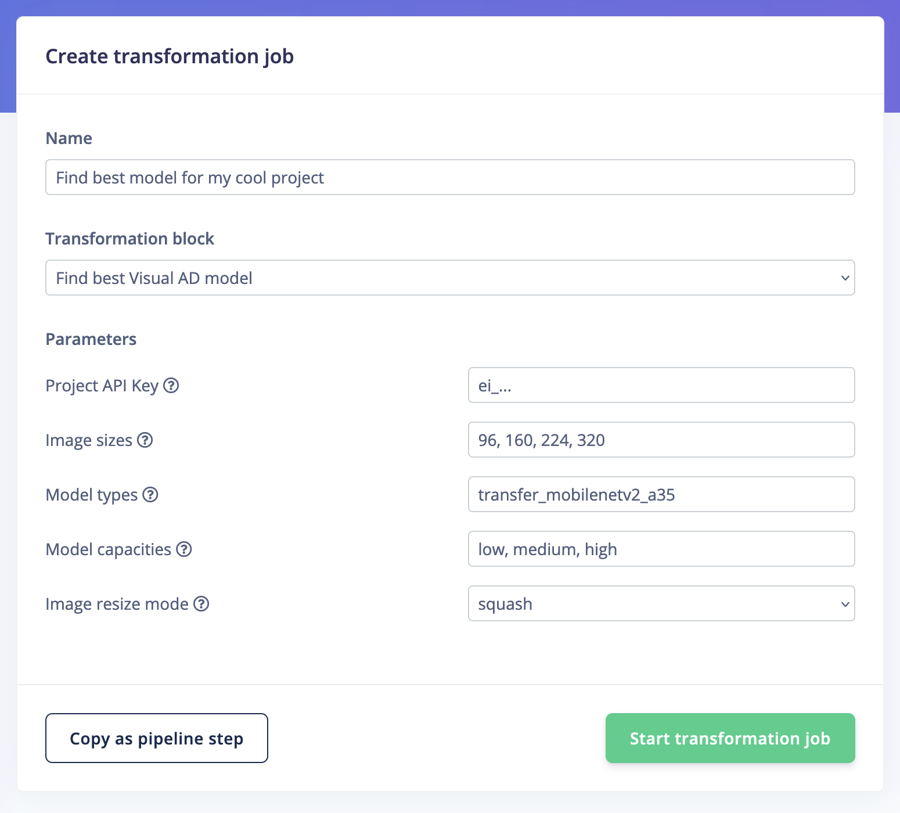

# Find the best FOMO-AD model (transformation block)

This repository searches through all possible configurations of image size, model capacity and model type to find the best performing configuration for visual anomaly detection in Edge Impulse. Models are trained through the Edge Impulse API ([source/search.ts](source/search.ts)), then analyzed to find the right threshold values in [source/analyze.ts](source/analyze.ts).

## Prerequisites

1. Create an Edge Impulse project that has access to to the visual anomaly detection features.
2. Upload your dataset:
    * The training set should only contain normal data.
    * The test set should contain both normal and anomalous data (labeled "no anomaly" and "anomaly"). These are used to calculate the accuracy of the model.

## How to run in Edge Impulse

1. Push this repository as a transformation block:

    Initialize:

    ```
    $ edge-impulse-blocks init

    Edge Impulse Blocks v1.24.0
    ? In which organization do you want to create this block? Demo Org Inc
    Attaching block to organization 'Demo Org Inc'
    ? Choose a type of block Transformation block
    ? Choose an option Create a new block
    ? Enter the name of your block Find best Visual AD model
    ? Enter the description of your block Brute-force your way through all Visual AD configurations
    ? What type of data does this block operate on? Standalone (runs the container, but no files / directories passed in)
    Your new block 'Find best Visual AD model' has been created in '~/repos/find-best-visual-ad-model'.
    When you have finished building your transform block, run 'edge-impulse-blocks push' to update the block in Edge Impulse.
    ```

    Push:

    ```
    $ edge-impulse-blocks push
    ```

2. Go to your Edge Impulse organization, choose **Custom blocks > Transformation**, find the 'Find best Visual AD model' block, click the three dots and select 'Run job'.
3. Enter your API key, choose your options, and hit "Start transformation job".

    

4. Give it a while, you'll get an email when the results are ready.

> To store the results (e.g. to analyze later), mount in an S3 bucket under `/data` - data will be automatically stored there.

## How to run locally

1. Install Node.js 18.
2. Install dependencies:

    ```
    $ npm ci
    ```

3. Build and run the script:

    ```
    # Build the script
    $ npm run build

    $ Run the script
    $ bash run.sh --api-key ei_...
    ```

    (To see all parameters, run `node build/search.js --help`)

## Output

For each configuration we loop through all anomaly thresholds between 0 and 20, and print the most promising results. E.g.:

```
result_224_medium.json:
   threshold 4.4 (highest overall accuracy):
        overall:    91.3%
        anomaly:    76.9%
        no anomaly: 97.0%
    threshold 4.2:
        overall:    87.0%
        anomaly:    92.3%
        no anomaly: 84.8%
    threshold 5.0:
        overall:    89.1%
        anomaly:    61.5%
        no anomaly: 100.0%

result_320_high.json:
   threshold 4.4 (highest overall accuracy):
        overall:    84.8%
        anomaly:    46.2%
        no anomaly: 100.0%

===

Best overall accuracy is 91.3% based on result_224_medium.json w/ threshold 4.4
```

You can then go into the Edge Impulse project and retrain with the parameters found above.
